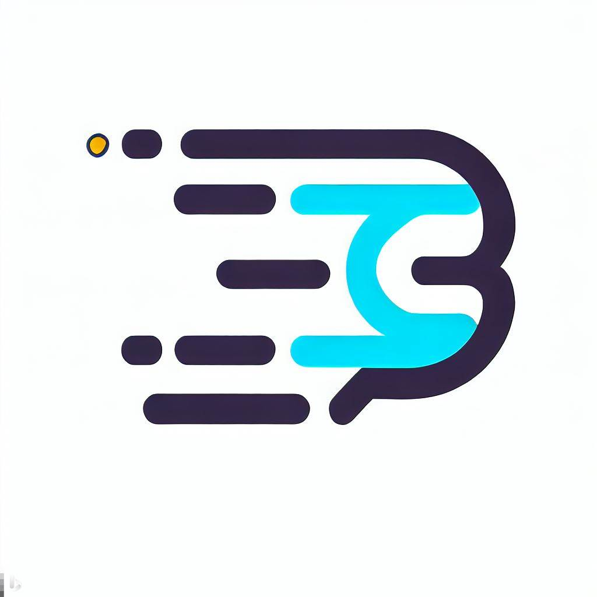

# RunLang

RunLang is held under the [GPL Generic Public v3 License](./LICENSE)

RunLang is a coding language that is based on c++. It is cross compatible with c++, and has a plethora of features so you can spend more time coding instead of screaming at why something doesn't work

## Table of Cometents
- [Download](./docs/Download.md)
- [Getting started](./docs/Getting-started.md)
- [Documentation](./docs//Documentation//Documentation.md)
